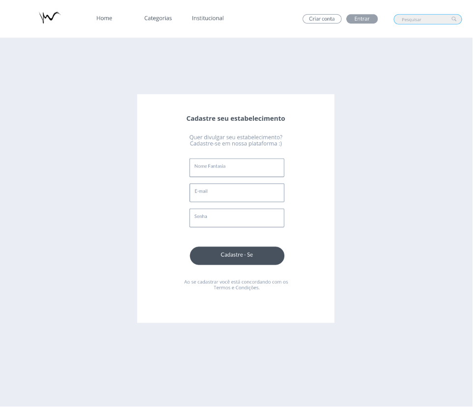
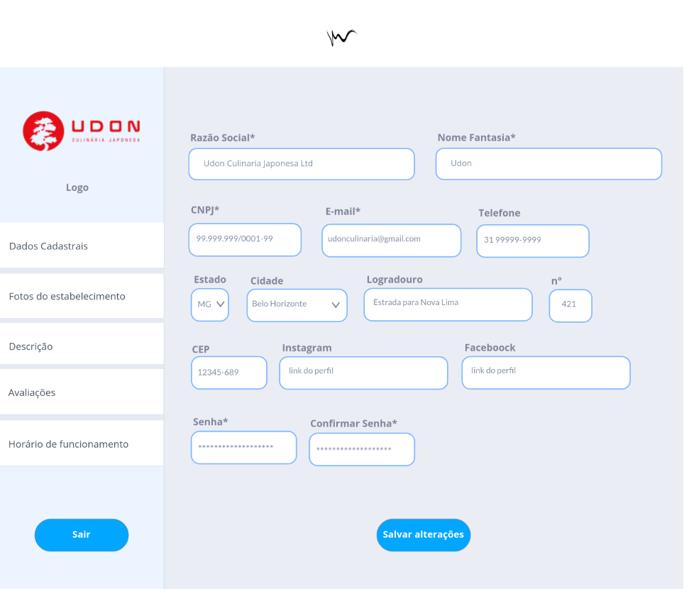

# Projeto de Interface

O desenho da interface do sistema, estabelece foco em questões como a interação com o usuário, apresentar o conteúdo ao usuário final, permitir sua navegação através dos seus segmentos. Desta forma, o projeto tem um padrão visual modular em todas as telas que serão projetadas para funcionamento em desktops e dispositivos móveis.

A seguir apresentamos a visão geral da interação do usuário pelas telas do sistema e protótipo interativo das telas com as funcionalidades que fazem parte do sistema (wireframes).

## User Flow
O diagrama apresentado na Figura 2 mostra o fluxo de interação do usuário pelas telas do sistema. Cada uma das telas deste fluxo é detalhada na seção de Wireframes que se segue. Para visualizar o wireframe interativo, acesse o [ambiente MarvelApp](https://marvelapp.com/prototype/6aed7hi)

Figura 2 - UserFlow

## Wireframes

Conforme fluxo de usuário do projeto, apresentado no item anterior, as telas do sistema são apresentadas em detalhes nos itens que se seguem. 
As telas do sistema apresentam uma estrutura comum que é apresentada na Figura 3. Nesta estrutura, existem 3 blocos, descritos a seguir.
- **Cabeçalho** - local onde são dispostos elementos fixos de identidade (logo) e navegação principal do site (menu da aplicação);
- **Conteúdo** - apresenta o conteúdo da tela em questão;
- **Rodapé** - apresenta os elementos de navegação, políticas de privacidade, logo e mídias sociais da aplicação.

Figura 3 - Estrutura Padrão

### Home Page
A tela de Home Page (inicial) é a primeira tela ao entrar no site, onde o usuário pode ter uma visão geral da aplicação, as principais informações e realizar a sua entrada ou criar uma conta.

Figura 4 - Home Page

### Resultado Pesquisa 
A tela mostra o resultado de uma pesquisa de estabelecimentos de acordo com os respectivos parâmetros.

Figura 5 - Resultado Pesquisa

### Página do Estabelecimento 
A tela da página do estabelecimento dispõe de todas as informações que o usuário busca de um determinado lugar, como fotos, endereço e telefones, e também as notas de cada setor do estabelecimento, coletadas através do sistema de avaliações da própria aplicação.

Figura 6 - Página do Estabelecimento

### Login

A tela de login possibilita ao usuário acesso ao seu perfil na aplicação, realizar um novo cadastro manual ou se cadastrar através da integração com o google e realizar alteração de senha.

Figura 7 - Tela de Login

### Identificação de cadastro do usuário

A tela de identificação de usuário interage como filtragem e direcionamento de modo que identifique o seu perfil de cadastro.

Figura 8 - Identificação de cadastro do usuário

### Cadastro Usuário

A página de cadastro permite com que o usuário registre-se no site fornecendo o seu nome completo, e-mail e senha de sua escolha.

Figura 9 - Cadastro do Usuário

### Perfil do Usuário
Uma vez que o usuário tenha efetuado o cadastro no site, ele terá acesso a um perfil pessoal exclusivo, no qual poderá fornecer informações adicionais sobre si mesmo, como endereço e número de telefone. Além disso, será possível acrescentar uma foto de perfil para tornar a sua conta mais personalizada. Caso seja necessário, o usuário também poderá alterar a sua senha de acesso através do seu perfil.

Figura 10 - Perfil do Usuário

### Cadastro Estabelecimento
A página de cadastro do estabelecimento parceiro permite com que o prestador registre-se no site fornecendo seus dados comerciais para que posteriormente, possa divulgar seu local na aplicação e promover eventos.

Figura 11 - Cadastro Estabelecimento

### Perfil Estabelecimento
A página de perfil do estabelecimento permite que o prestador inclua as fotos do local, informe seu endereço, telefone, uma breve descrição sobre seu estabelecimento e escolha as categorias que gostaria de ser avaliado.

Figura 12 - Página perfil do estabelecimento

### Tela institucional

A página apresenta a nossa história, motivação, objetivos, políticas e normas, ou seja, é o espaço da aplicação destinado para passar confiança aos visitantes.

Figura 13 - Tela Institucional
