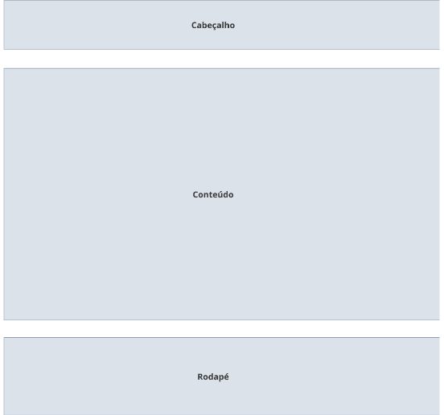

# Template padrão do site

Pré-requisitos: <a href="2-Especificação do Projeto.md"> Especificação do Projeto</a>, <a href="3-Projeto de Interface.md"> Projeto de Interface</a>, <a href="4-Metodologia.md"> Metodologia</a>

Layout padrão do site (HTML e CSS) que será utilizado em todas as páginas com a definição de identidade visual, aspectos de responsividade e iconografia.

> **Links Úteis**:
>
> - [CSS Website Layout (W3Schools)](https://www.w3schools.com/css/css_website_layout.asp)
> - [Website Page Layouts](http://www.cellbiol.com/bioinformatics_web_development/chapter-3-your-first-web-page-learning-html-and-css/website-page-layouts/)
> - [Perfect Liquid Layout](https://matthewjamestaylor.com/perfect-liquid-layouts)
> - [How and Why Icons Improve Your Web Design](https://usabilla.com/blog/how-and-why-icons-improve-you-web-design/)

O padrão de layout a ser utilizado pelo site tem correspondência ao projeto de Interface elaborado anteriormente, conforme figura 15.

Figura 15 - Template padrão do site

O template criado está disponível no site Template City Wave GitHub Pages e é composto pelos seguintes layouts:
- Home Page
- Tela de login
- Tela de cadastro de usuário
- Tela de cadastro do estabelecimento
- Tela individual do estabelecimento
- Tela Institucional

A responsividade segue o padrão do Bootstrap e aplicação do mecanismo Cascading Style Sheets.

# Home Page

Tela principal do site, ou seja, ela é a página de entrada.

Figura 16 - Home Page

# Tela Login

A tela de login permite que o usuário acesse a plataforma, inserindo o nome de usuário e senha cadastrada.

Figura 17 - Tela de Login

# Tela de cadastro de usuário
Tela que permite ao usuário realizar um cadastro na plataforma.

Figura 18 - Tela de cadastro do usuário

# Tela de cadastro do estabelecimento
Tela que permite ao prestador de serviços realizar um cadastro na plataforma de seu estabelecimento para gerenciá-lo futuramente.

Figura 19 - Tela de cadastro do estabelecimento

# Tela individual do estabelecimento

Tela que permite ao usuário visualizar o estabelecimento selecionado juntamente com as informações referente, avaliações, descrição e adicionar como favorito.

Figura 20 - Tela individual do estabelecimento

# Tela Institucional

Tela que permite aos usuários visualizarem os valores, objetivos e políticas da aplicação.

Figura 21 - Tela Institucional
