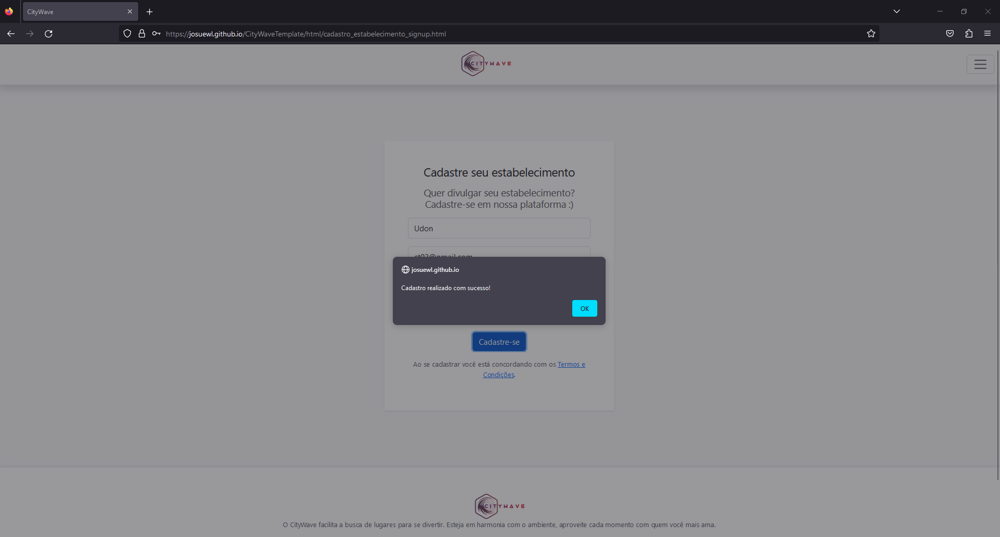
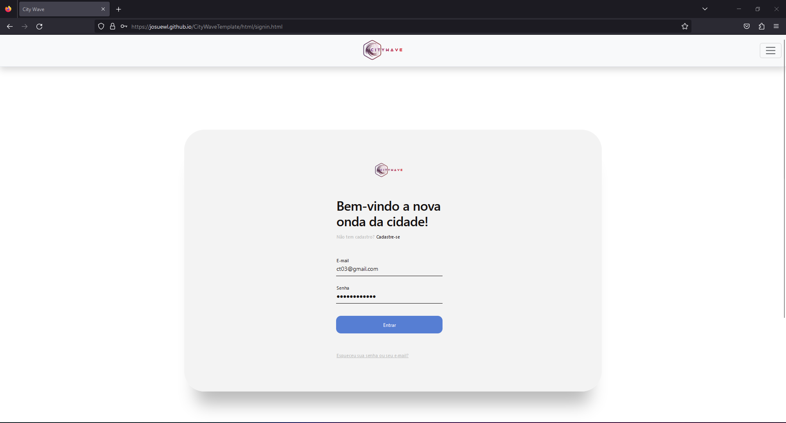

# Registro de Testes de Software

Pré-requisitos: <a href="3-Projeto de Interface.md"> Projeto de Interface</a>, <a href="8-Plano de Testes de Software.md"> Plano de Testes de Software</a>

Os registros dos testes realizados na aplicação estão descritos abaixo.

## Casos de Sucesso
CT – 01 - Apresentação página home
> - Acessar o link [CityWave](https://josuewl.github.io/CityWaveTemplate/index.html)

Figura 27 - Página Home

A aplicação foi responsiva ao abrir a tela de Home. Houve apresentação da imagem dinâmica. Todos os elementos da página carregaram sem apresentar demora ou algum tipo de travamento. 

> - Clicar em "Descobrir Agora"

Figura 28 - Página Home

Ao passar o mouse sobre o botão “Descobrir Agora” o mesmo sobressaiu da tonalidade branca para a azul, permitindo ao usuário que percebesse a opção de clique.

Figura 29 - Página lista estabelecimentos

Após clicar em “Descobrir Agora” a aplicação direcionou a uma segunda página onde foi apresentada a lista de estabelecimentos que estão cadastrados. Em nenhum momento solicitou o “Login” para acessar. Todos apresentaram pelo menos uma imagem, os botões “Favoritar” e “Ver Detalhes”. 

<b>Resultado: </b>Êxito. Foi possível através do passo a passo, chegar a finalidade de visualização dos estabelecimentos da aplicação.

CT – 03 - Cadastro e Login
> - Acessar o link [CityWave](josuewl.github.io)

Figura 30 - Página Home

> - Acessar o "Menu"

Figura 31 - Página Menu

Ao clicar nos 3 (três) traços apresentados no canto superior direito da tela, é possível acessar o “Menu”.

> - Clicar em "Criar Conta"

Figura 32 - Página Cadastro Estabelecimento

> - Digitar as Informações e Clicar no botão "Cadastre-se"

Figura 33 - Página Cadastro 

Figura 34 - Página de Cadastro com Sucesso

Após digitar todas as informações do caso em teste, a aplicação apresentou a mensagem de sucesso ao salvar os dados. 

> - Acessar a página de "Login" utilizando as mesmas credenciais

Figura 35 - Página de Login

Figura 36 - Página de Login com Sucesso

Figura 37 - Página Perfil do Estabelecimento

<b>Resultado: </b>Êxito. A aplicação permitiu que o prestador fizesse o login utilizando as mesmas informações usadas no cadastro.

CT – 06- Perfil do Prestador
> - Acessar o link [CityWave](josuewl.github.io)

Figura 38 - Página Home

> - Efetuar Login

Figura 39 - Página Login

> - Acessar Perfil

Figura 40 - Página Perfil do Prestador

> - Efetuar Alterações

Figura 41 - Página Perfil Prestador - Dados Cadastrais. 

Figura 42 - Página Estabelecimentos - Alterações Cadastrais.

Figura 43 - Página Perfil Prestador - Imagens

Figura 44 - Página Estabelecimentos - Alteração da Imagem

Figura 45 - Página Perfil Prestador - Imagens

Figura 46 - Página Estabelecimento

<b>Resultado:</b> Êxito. Após efetuar o “Login” foi possível alterar todas as informações e imagens propostas.

## Casos de Falhas

CT – 02- Filtro Estabelecimento
> - Acessar o link [CityWave](josuewl.github.io)

Figura 47 - Página Home

> - Clicar em "Descobrir Agora"

Figura 48 - Página Home

> - Ir no "Menu"

Figura 49 - Página Menu

> - Categorias

Figura 50 - Página Categorias

> - Selecionar uma Categoria

Figura 51 - Categoria selecionada

<b>Resultado: </b>Não foi apresentada nenhuma alteração na página da aplicação ao selecionar uma categoria.

CT – 04- Perfil Consumidor e Botão Favorito

<b>Resultado: </b>Não houve desenvolvimento dos requisitos funcionais 07 e 08.

CT – 05- Avaliação dos Estabelecimentos

<b>Resultado: </b>Não houve desenvolvimento do requisito funcional 09.

## Avaliação

A aplicação conseguiu apresentar sua principal proposta: a de cadastro dos estabelecimentos e a apresentação dos mesmos em uma lista para que o usuário possa verificar suas informações.

Os pontos identificados para serem melhorados e o principal foco da equipe são: o desenvolvimento dos requisitos funcionais 07 e 08 (Perfil Consumidor/Usuário e Botão Favorito), assim como o requisito funcional 09 (Avaliação dos estabelecimentos).
